# Warewulf:
## step 1 : setting up the OS
```bash
setenforce 0
sed -i 's/^SELINUX=.*$/SELINUX=disabled/g' /etc/selinux/config
systemctl stop firewalld
systemctl disable firewalld
nmcli con up ens33
nmcli con up ens34
hostnamectl set-hostname master
echo "`ip a | grep ens34 | tail -1 | cut -d' ' -f6|cut -c 1-12` master" >> /etc/hosts
su
```

## step 2 : installing warewulf
```bash
# adding the repository
yum install -y https://repo.ctrliq.com/rhel/8/ciq-release.rpm

# installing the warewulf
yum install -y warewulf
```

## step 3 : making changes to warwulf.conf
```bash
vim /etc/warewulf/warewulf.conf
    Line no 2: change ip address
    Line no 4: change network
    Line no 14: change DHCP starting ip address
    Line no 15: change DHCP ending ip address

# configure the warewulf
wwctl configure --all

# check if all the services are running or not
systemctl status dhcpd tftp nfs-server warewulfd

# if services are not running then restart the services
systemctl start dhcpd tftp nfs-server warewulfd

# enable the services
systemctl enable dhcpd tftp nfs-server warewulfd

# check logs if necessary
cat /var/log/warewulfd.log
```
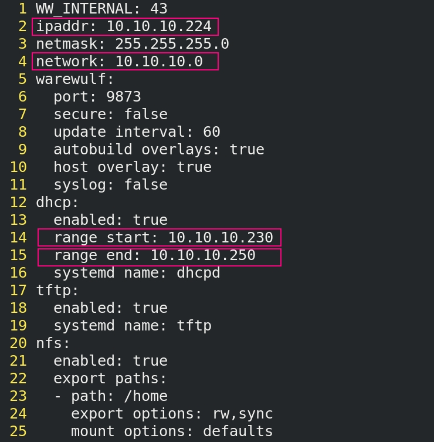
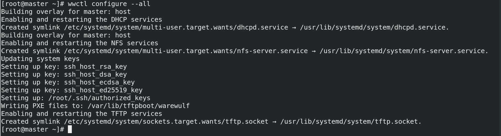
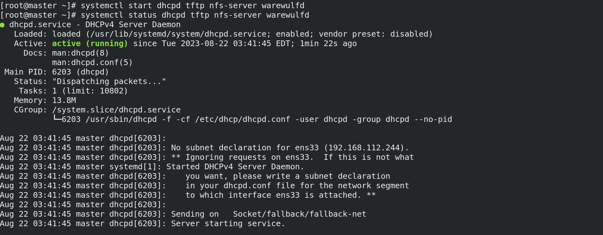
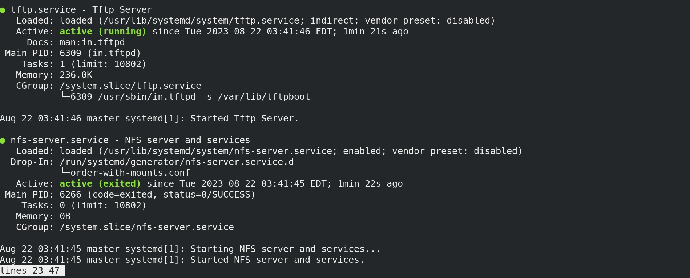

## step 3 : booting the node using container
```bash
# import container from docker hub
wwctl container import docker://warewulf/rocky rocky-8


# to check container list
wwctl container list

# to modify the container
wwctl container exec rocky-8 /bin/bash
    dnf install -y passwd
    passwd root
        new password : root
        re enter password : root
    exit
    
# sync host uid & gid with the container
wwctl overlay build
wwctl container syncuser --write rocky-8
```

## Step 4 : Add a node 
```bash
# to add a node without knowing MAC address
wwctl node add node1 --ipaddr 10.10.10.232 --discoverable ens34

# to add a container to a given node
wwctl node set --container rocky-8 node1
```
\# Note : `if this error shows: hub_port_status failed (err = 110)`  
\# Solution : disable the USB device or remove  
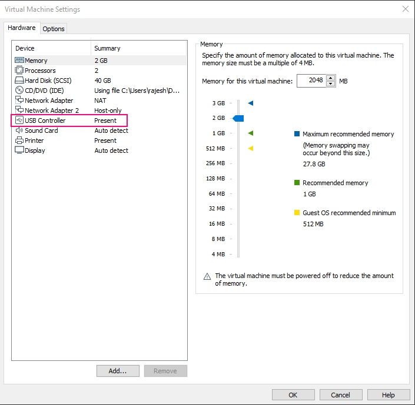

# Installing Slurm 

## Step 1: Install munge service on both master & container
```bash
# installing epel-release repository
dnf install epel-release -y

# adding powertools repository
dnf config-manager --set-enabled powertools

# installing munge packages
dnf install munge* -y

# intalling rng-tools used for gathering harware entropy
dnf install rng-tools.x86_64 -y
dnf repolist

# starting the random number generator demon
systemctl start rngd
systemctl enable rngd
systemctl status rngd
```

```
Randome number generator
to generate secure cryptographic keys that cannot be easily broken, a source of random numbers is required. Generally, the more random the numbers are, the better the chance of obtaining unique keys. Entropy for generating random numbers is usually obtained from computing environmental “noise” or using a hardware random number generator.

The rngd daemon, which is a part of the rng-tools package, is capable of using both environmental noise and hardware random number generators for extracting entropy.
```
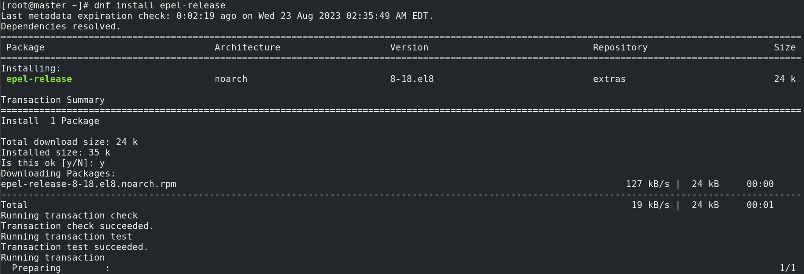

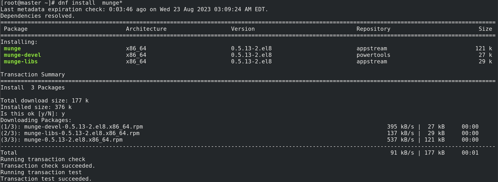
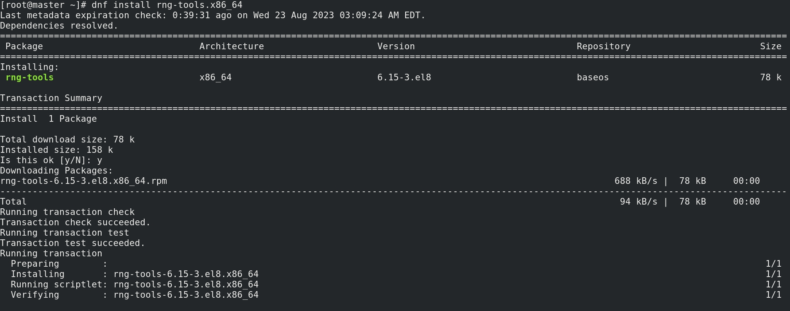
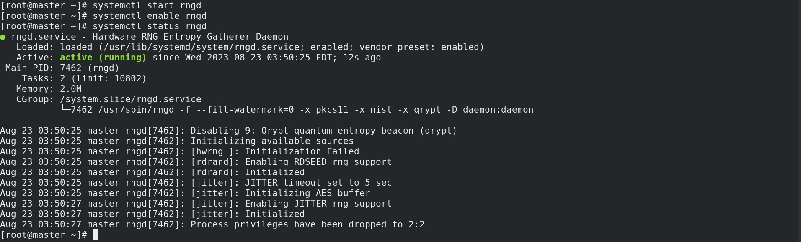

## Step 2: generate munge key
```bash
/usr/sbin/create-munge-key -r

# copy the monge key to container
wwctl container exec --bind [path on master]:[path on container] [container name] /bin/bash

# copy the munge file 
cp /etc/munge/munge.key root/Documents/temp
```


## resolving Error ( glibc )
```bash
# install language to resolve this error
dnf install langpacks-en glibc-all-langpacks -y
```
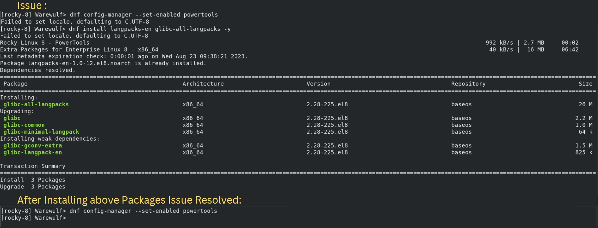


## Step 3 : setting up the munge key in container
```bash
# copy the munge key in the default location
cp 
chown munge:munge /etc/munge/munge.key
```

## Step 4: Installing Slurmd 
```bash
# first download the tar file 
wget https://download.schedmd.com/slurm/slurm-20.11.9.tar.bz2

# download the rpm-build package
dnf install rpm-build make -y
# build the packages from tar file
rpmbuild -ta slurm-20.11.9.tar.bz2
# to install the dependencies
dnf install pam-devel python3 readline-devel perl-ExtUtils-MakeMaker gcc mysql-devel -y
# now try to build the package again
rpmbuild -ta slurm-20.11.9.tar.bz2
``` 
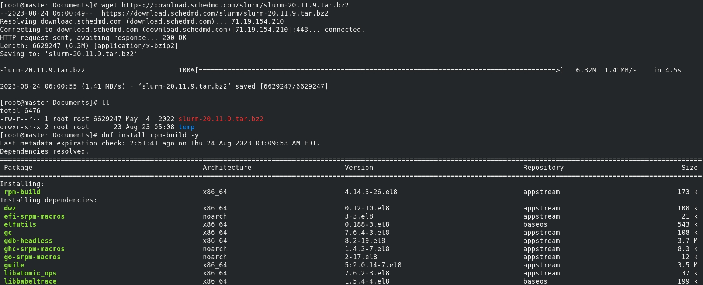
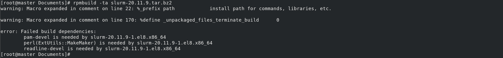
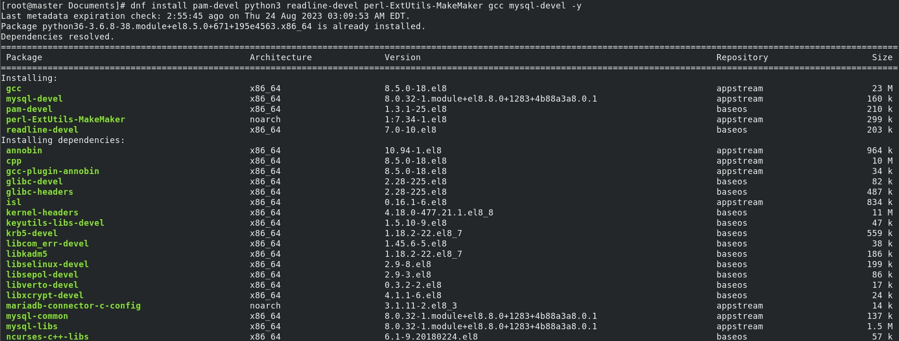

## Step 5: Create Slurm User for SLURM Service
```bash
export SLURMUSER=900;
# add group
groupadd -g $SLURMUSER slurm;
# create user
useradd -m -c "SLURM workload manager" -d /var/lib/slurm -u $SLURMUSER -g slurm -s /bin/bash slurm;

cat /etc/passwd | grep slurm;
```
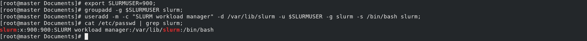
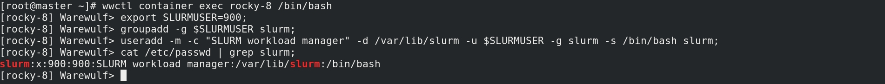

## Step 6: installing packages from rpm builds
```bash
# navigate to the directory
cd /root/rpmbuild/RPMS/x86_64/

# installing local packages
dnf --nogpgcheck localinstall * -y

# to confirm if packages has been installed or not
rpm -qa | grep slurm | wc -l

# copy packages to shared folder with container
cp * /root/test/;
```
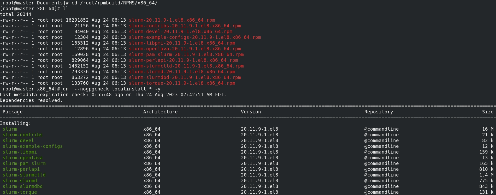
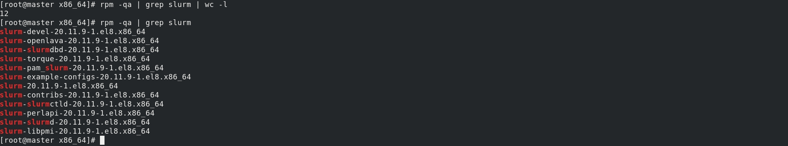
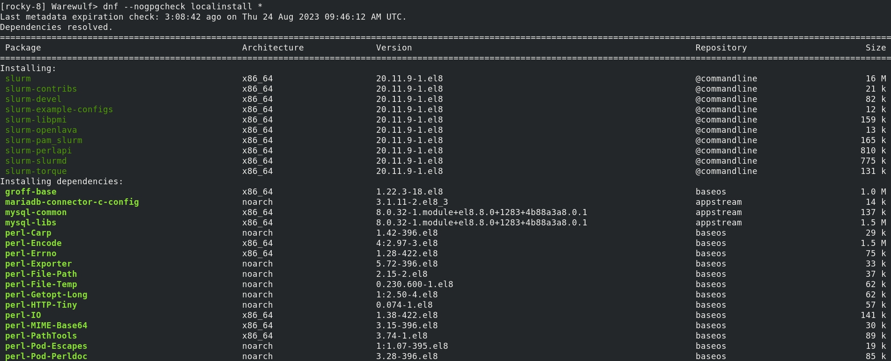

## Step 7: creating repositories for slurm on master & node
```bash
# create folder 
mkdir /var/spool/slurm

# change ownership of the slurm service on both client and master
chown slurm:slurm /var/spool/slurm

# change mod
chmod 755 /var/spool/slurm

# create folder 
mkdir /var/log/slurm

# change ownership of the slurm service on both client and master
chown slurm:slurm /var/log/slurm

# create log files
touch /var/log/slurm_jobacct.log /var/log/slurm_jobcomp.log

# change ownership
chown slurm:slurm /var/log/slurm_jobacct.log /var/log/slurm_jobcomp.log
```
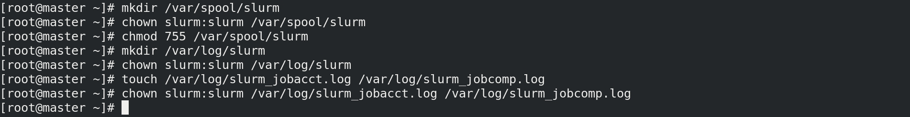

## Step 8: Edit the configuration file 

```bash
# copy the example config file 
cp /etc/slurm/slurm.conf.example /etc/slurm/slurm.conf

# edit the config file and add node entry
vi /etc/slurm/slurm.conf
    edit : clusterName=warewulf-cluster
    edit : clusterMachine=master
    edit : slurmUser=slurm
    edit : #COMPUTE NODES
            #NodeName=node[1-2] Procs=1 State=UNKOWN
            NodeName=node1 CPUs=2 Boards=1 SocketsPerBoard=2 CoresPerSocket=1 ThreadsPerCore=1 RealMemory=7928
            ParitionName=standard NODES=ALL Default=YES MaxTime=INFINITE State=UP
            :wq # save and exit

# run on client and get the satus of the node(but node has to be in booted state) and paste this information in the configuration file
slurmd -C

# give ownership to slurm 
chown slurm:slurm /etc/slurm/slurm.conf

# copy this config file to shared folder on the nodes
cp /etc/slurm/slurm.conf /root/Documents/slurm/

# start slurmctld service on master
systemctl start slurmctld;systemctl enable slurmctld;

# start slurmd service on node1
systemctl start slurmd;systemctl enable slurmd;
```
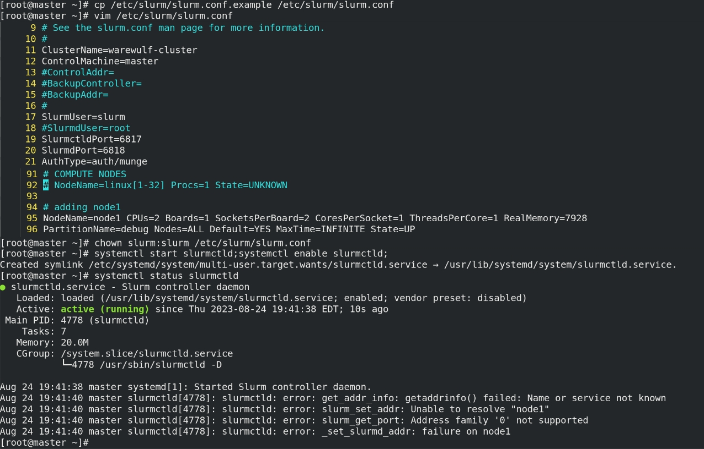

## Step 9: to sync the the user with containers we use the command
```bash
# to rebuild the overlays 
wwctl overlay build
wwctl container syncuser --write rocky-8

# to debug error in slurmd 
slurmd -Dvv
``` 
---
# Installing Ganglia

## Step 1: Installing the Ganglia on master node
```bash
dnf install epel-release -y
dnf install ganglia ganglia-gmetad ganglia-gmond ganglia-web -y
```
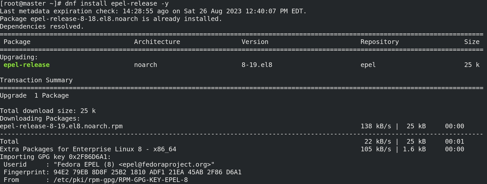
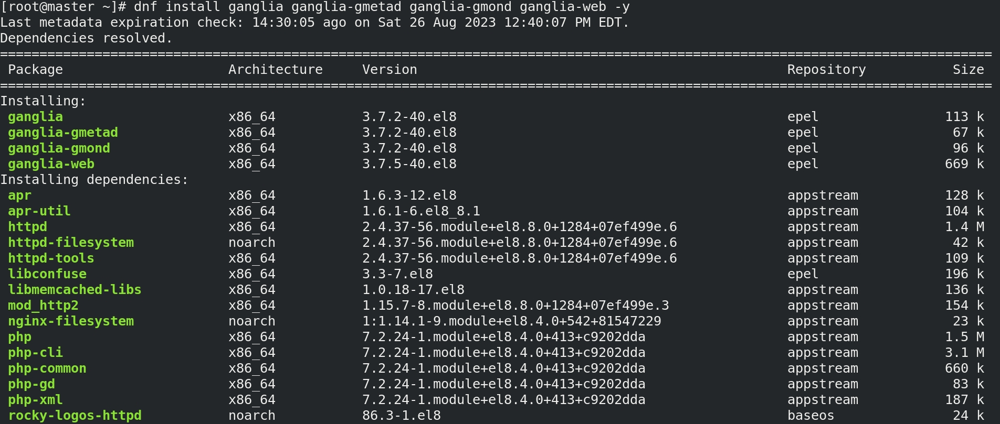

## Step 2: Edit the conf files on master node
```bash
# on master 
vim /etc/ganglia/gmetad.conf
    line no 44: Change the cluster name


vim /etc/ganglia/gmond.conf
    line no 30: give the cluster name
    line no 31: set the owner name
    line no 50: give the master ip address
    line no 57: comment this line
    line no 59: comment this line
```
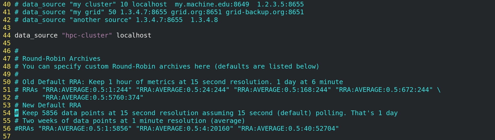
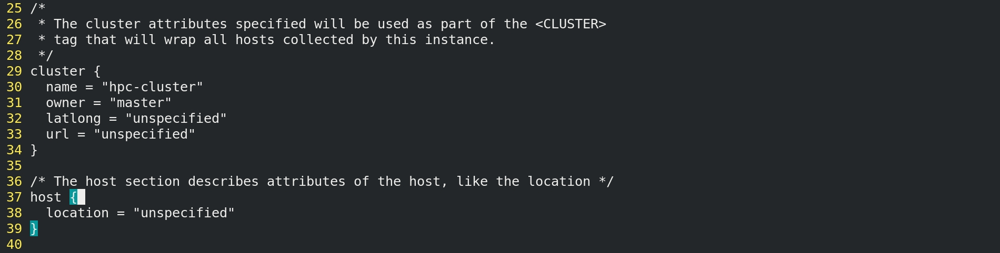
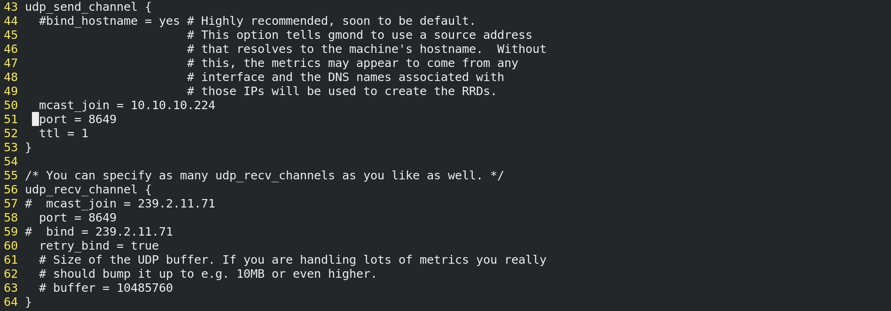

## Step 3: Start the services on master: 
```bash
systemctl start gmetad gmond httpd
systemctl enable gmetad gmond httpd
systemctl status gmetad gmond httpd
```
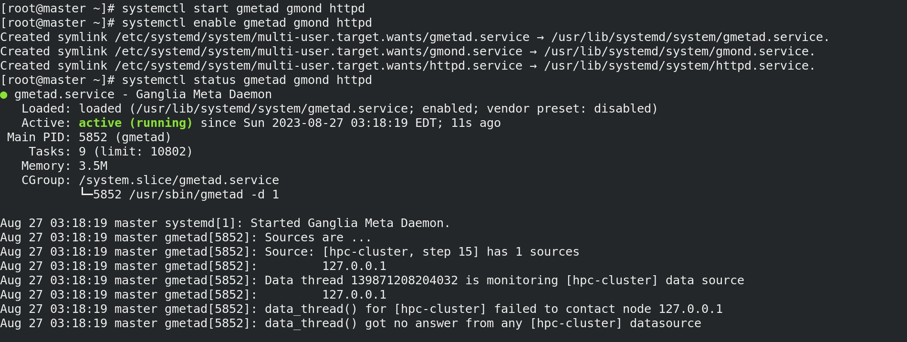
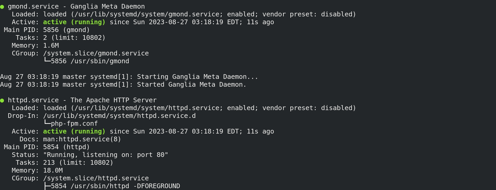

## Step 4: Installing the Ganglia on Container 
```bash
dnf install epel-release -y
dnf install ganglia ganglia-gmond -y
```
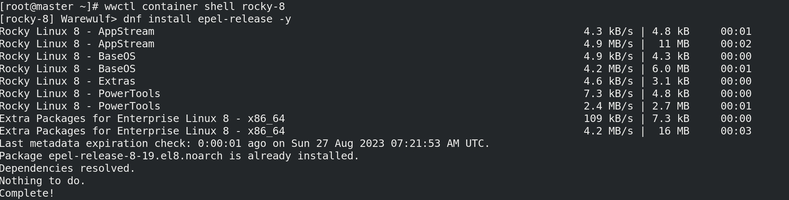
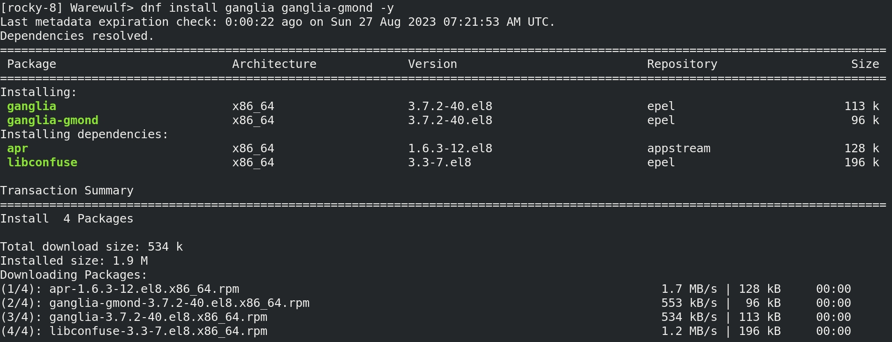

## Step 5: Edit the gmond.conf file on Container 
```bash
vim /etc/ganglia/gmond.conf
    line no 30: give the cluster name
    line no 31: set the owner name
    line no 50: give the master ip address
    line no 57: comment this line
    line no 59: comment this line
```
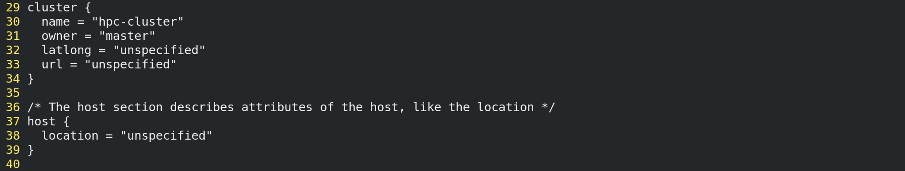


## Step 6: Start the services on container: 
```bash
# service get started after nodes get booted
systemctl start gmond 
systemctl enable gmond 
systemctl status gmond 
```
## Step 7: Rebuild container
```bash
# this command will sync host user to container 
wwctl container syncuser --write rocky-8
# this command will build overlay for given container
wwctl overlay build 
# this command rebuild the container forcefully
wwctl container build -f rocky-8
``` 
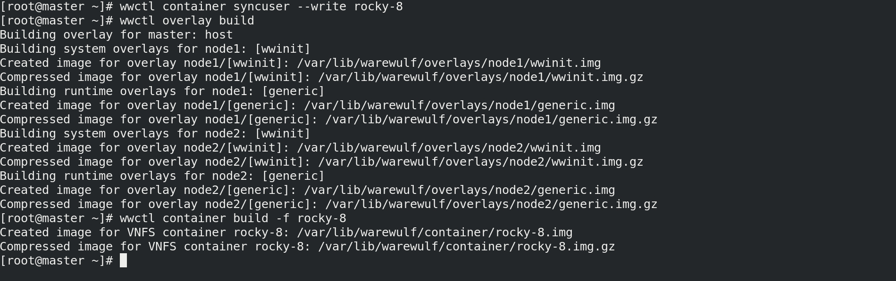

## Step 8: after successfully booting up the node
```bash
# Results
```
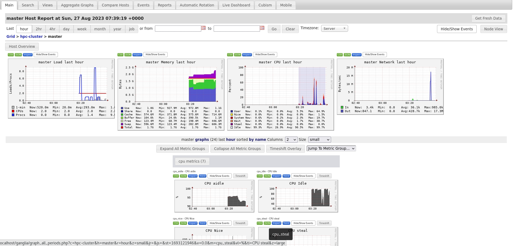
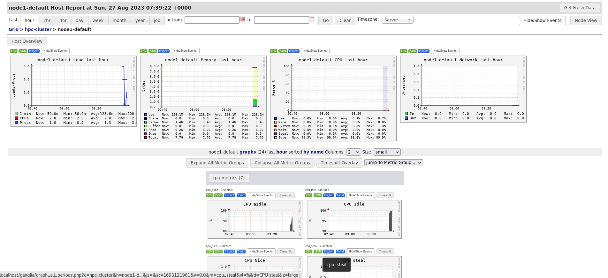


